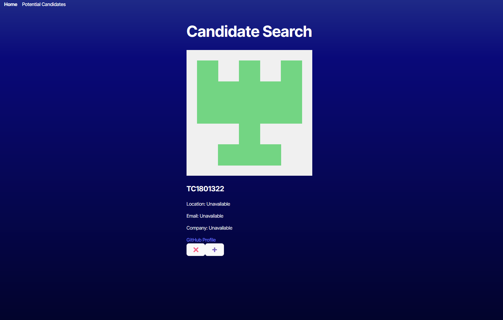
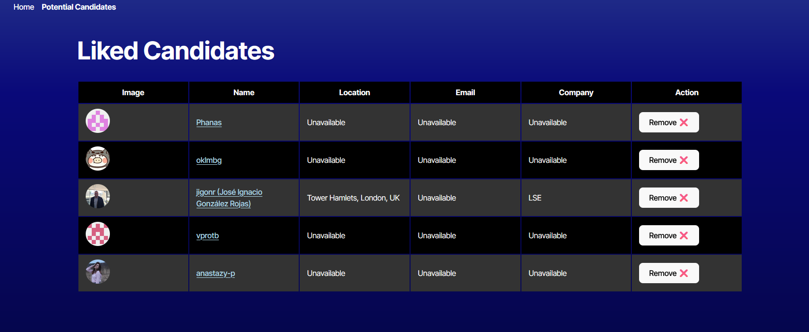

# Candidate Search Application

## Description

This project is a candidate search application that allows employers to search for potential candidates by retrieving data from the GitHub API. The front end is built with TypeScript, and the application is deployed on Render.

## Table of Contents

- [Installation](#installation)
- [Usage](#usage)
- [License](#license)
- [Contributing](#contributing)
- [Questions](#questions)

## Installation

To install the necessary dependencies, run the following command:
```
npm install
```
Ensure you have a GitHub Personal Access Token (PAT) set up to increase the API rate limit. The .env file should contain your GitHub token.

## Usage

Once the dependencies are installed, run the application using the following command:

npm run start

The candidate search page will load, displaying information about a candidate, including:

- Name
- Username
- Location
- Avatar
- Email
- HTML URL
- Company

You'll be able to:

- Save a candidate by clicking the "+" button, adding them to the list of potential candidates.
- Reject a candidate by clicking the "X" button, moving to the next candidate without saving.
- View the list of potential candidates with their details.

When there are no more candidates, the app will display an appropriate message indicating the end of available candidates.

### Home page:



### Saved Candidates Page:



## License

This project is licensed under the MIT License.

## Contributing

For now, this project is locked down and private. No contributions will be accepted since this is a solo class project.

## Questions

If you have any questions, feel free to open an issue.

Visit my GitHub profile: your-github-username

Generated by your-github-username's Professional-README-Generator